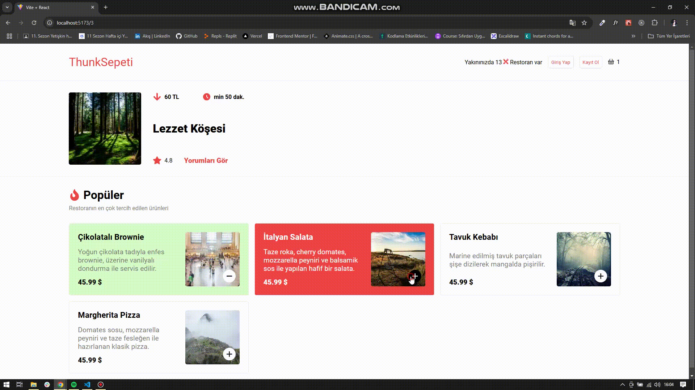

# YemekSepeti

Hello everyone. Thanks to the course I took on Udemig, I added a new one to my projects. Here is a "YemekSepeti Projects" created with react.

# Usage Tecnologies

- React-redux
- React-toolkit
- React-icons
- React-toastify
- Axios
- Json-server
- Uuid
- Scss
- React-router-dom

It is compatible with mobile and tablet devices with responsive design.

# Short Gif

